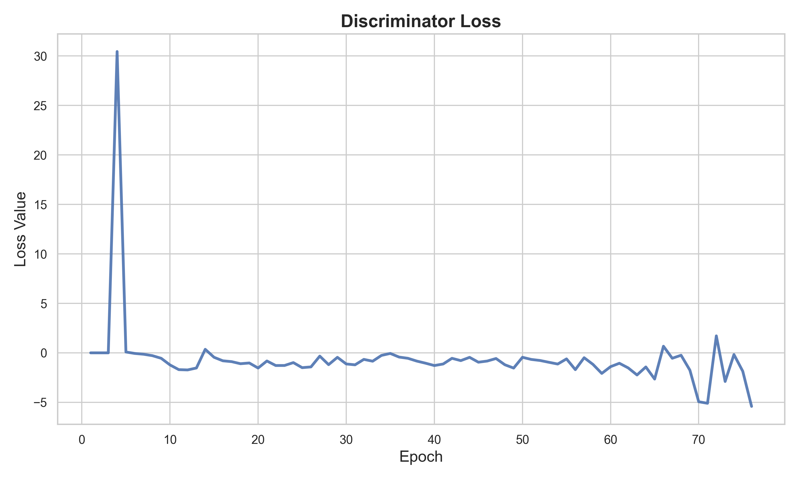
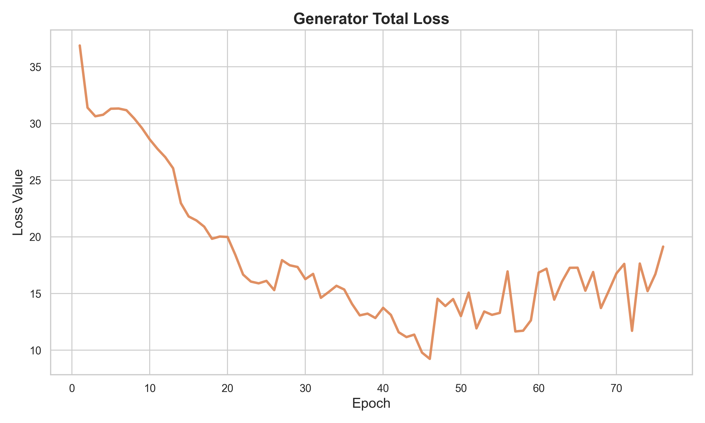
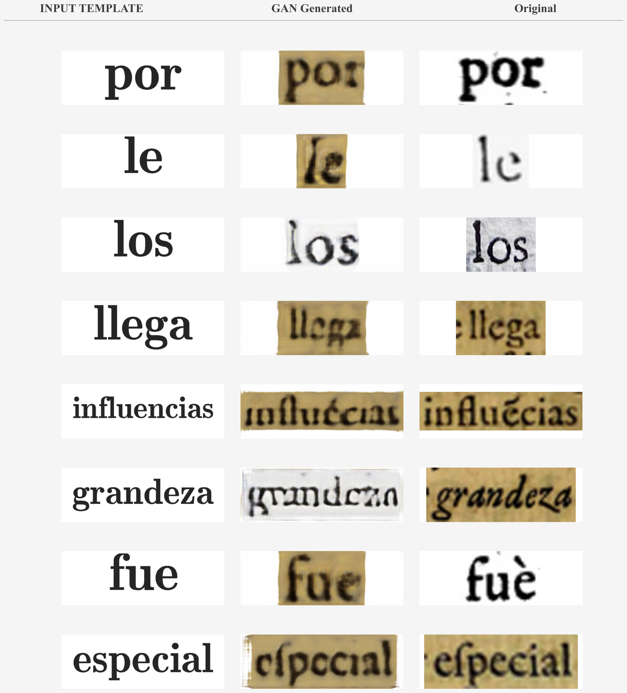
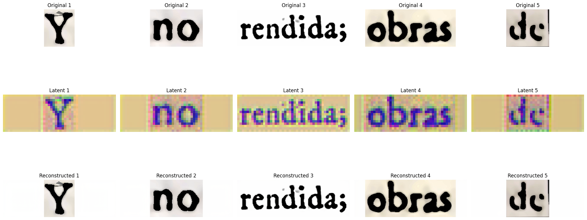
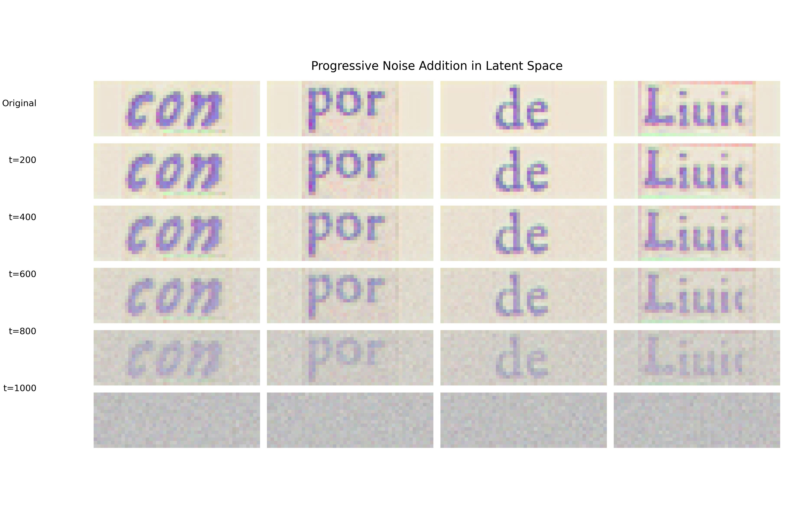
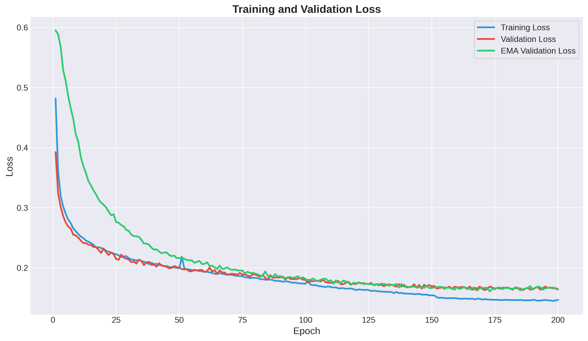
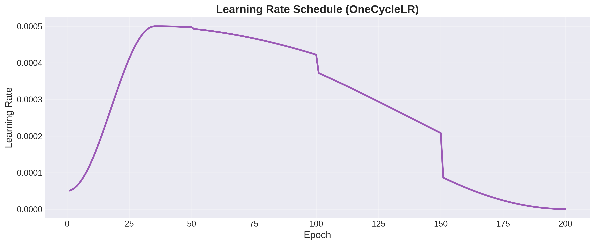

# Human AI RenAIssance Specific Task III

## Task
Design a Mid-scale generative model to create synthetic Renaissance-style printed text. The model should introduce realistic printing imperfections such as ink bleed, smudging, or faded text. 
Use a sample of historical Spanish text (from the 17th century, available as part of other specific tests) and generate images for at least 5 pages from the Word file with visible degradation effects. 
Document the approach, including model choice (GANs, diffusion models, or another method), dataset preparation, and implementation steps. Also, evaluate how well the generated text mimics historical printing artifacts using a quantitative metric.

## Overview
This repository contains my solution for specific task III for GSOC 2025 Selection. I have experimented with 2 different generative models:
1. GAN Model
2. Diffusion Model

## Introduction
Generating an entire page image with proper visible text is a difficult task even with good amount of data available 
and as we were provided with a very limited amount of page images, it is not possible to generate entire pages
directly. So my approach include training a WGAN model and a Latent Diffusion Model on word level images and then rendering the 
entire page word by word using the developed model. Building a model to degrade the page is a relatively easier task 
and can be done by a CycleGAN model or a pretrained image to image model. My main focus is to develop a model 
that is able to generate the renaissance font style accurately.

## GAN Model

### Dataset Preperation
1. Preprocessed images and performed text detection using pretrained CRAFT model to detect word level bounding boxes.
2. Used Pytesseract to map the bounding boxes with their corresponding transcripts word to generate label data which can be used for training.
3. Generated LATEX rendered source images that will be used by the GAN model to perform Image to Image translation
4. Final dataset contain source-target image pairs that will be used to train the WGAN model.

### Architecture

For the GAN model, I implemented an enhanced Pix2Pix architecture with several specialized components designed specifically for Renaissance text generation:

1. **Generator Architecture**:
   - **Enhanced Text Generator**: A modified U-Net architecture with specialized components for text rendering
   - **Text-Optimized Encoder**: Uses asymmetric convolutions with horizontal bias to better capture text features
   - **Multi-Scale Self-Attention**: Three attention layers at different scales to handle fine details (characters), medium features (words), and global structure
   - **Dilated Residual Bottleneck**: Provides wider receptive field using dilated convolutions with rates 1, 2, and 4
   - **Feature Refinement**: Skip connections with refinement modules to preserve important text details
   - **Text-Aware Decoder**: Uses horizontal bias in convolutions to generate sharper text

2. **Discriminator Architecture**:
   - **Multi-Scale PatchGAN**: Evaluates patches at three different scales for more comprehensive feedback
   - **Spectral Normalization**: Applied to all convolutional layers for training stability
   - **Text-Aware Attention**: Self-attention module at mid-level features to focus on text structure
   - **Asymmetric Initial Layer**: Specialized kernel (3×5) for better text feature extraction

### Training Process

The GAN was trained with several advanced techniques for improved performance and stability:

1. **WGAN-GP Loss**: Implemented Wasserstein GAN with gradient penalty for more stable training
2. **Multi-Component Loss**: Combined adversarial loss, L1 pixel loss, and VGG perceptual loss
3. **Adaptive Learning**: Learning rate scheduling with ReduceLROnPlateau to adjust based on performance
4. **Noise Injection**: Added decaying noise to discriminator inputs to prevent mode collapse
5. **Generator Warmup**: Exclusive generator training for first 3 epochs to establish a good starting point
6. **Early Stopping**: Implemented patience-based stopping to prevent overfitting

Key hyperparameters:
- Batch Size: 16
- Learning Rates: 0.0001 (G), 0.00005 (D)
- Loss Weights: λ_L1 = 100, λ_GP = 10, VGG weight = 5.0
- Training Duration: Up to 250 epochs with patience of 30

  

### Evaluation Metrics

The model was evaluated using multiple complementary metrics:

1. **FID (Fréchet Inception Distance)**: Measures the distance between feature distributions of real and generated images
2. **SSIM (Structural Similarity Index)**: Evaluates structural similarity between generated and target images
3. **LPIPS (Learned Perceptual Image Patch Similarity)**: Assesses perceptual differences using deep features
4. **L1 and PSNR**: Traditional pixel-wise accuracy metrics
5. **Histogram Similarity**: Measures style transfer accuracy through intensity distribution comparison

### Results

| Metric        | Value     | Std Dev   |
|---------------|-----------|-----------|
| FID           | 192.8835  | —         |
| SSIM          | 0.5376    | 0.1674    |
| LPIPS         | 0.4367    | 0.1305    |
| L1            | 0.3137    | 0.1602    |
| PSNR          | 6.6065    | 2.8705    |
| HistSim       | 0.2071    | 0.2376    |

## Latent Diffusion Model

### Dataset Preperation

1. The PDF files were split into individual pages.
2. Various preprocessing operations were applied on the images like skew correction, normalization, 
scaling, ink bleed removal, denoising, sharpening, contrast enhancement, morphological operations 
and binarization. These operation improve text clarity.
3. Text detection was done using pretrained CRAFT model, the model detected bounding boxes at 
word level.
4. Used Pytesseract OCR model to map the detected bounding boxes with its corresponding transcript 
word.
5. Resized all the images to (3,384,128) dimension based on aspect ratio. This is necessary because our
latent diffusion model will require an input of fixed dimension and this size require minimum 
padding.
6. Generated a dataset of word images and their corresponding label for training the model

### Working of Latent Diffusion Model

1. Since LDMs do not apply diffusion directly to high-resolution images, we first compress the word images into a lower-dimensional latent space. This is done using a Variational Autoencoder (VAE).

2. Diffusion process:
   * **Noise Addition (Forward Process)**
     * Random Gaussian noise is added step by step to the latent representation of the word image.
     * After many steps, the latent code becomes pure noise.
   * **Denoising (Reverse Process)**
     * A U-Net model is trained to remove noise step by step, reconstructing a valid latent representation of a historical word.
     * The model learns to recover meaningful word images from noise.

### Implementation Steps

1. **Decoding**: For the purpose of decoding image I have used a pretrained VAE model from Stable Diffusion. For embedding the text I have used FastText embedding model.

2. I have used PyTorch and Hugging Face to build the Noise Scheduler for adding noise to the image and U-Net model for denoising.

3. I trained 2 different U-Net architectures with Cosine_hard_restart and OneCycle Learning rate scheduler.

4. Mean Squared Error was used as a loss function and the model was trained for 200 epochs.

5. Exponential Moving Average of the weights is taken over the training epochs to generate an EMA model. This allows us to build a better denoising model.

### Evaluation Metrics

The following evaluation metrics were used:
1. LPIPS (Learned Perceptual Image Patch Similarity): Measures perceptual similarity between images, based 
on deep feature representations.
    -   Instead of comparing pixel-wise differences, LPIPS extracts deep features from an image 
  using a pretrained CNN. I have used VGGNet.
    -   These feature maps capture high-level perceptual similarities (e.g., texture, structure, and 
  semantics).
    -   The Euclidean distance between the feature maps of the original and generated image is 
  computed.
3. MSE (Mean Squared Error): Compares images pixel by pixel. Computes the squared difference between 
corresponding pixels and averages it over all pixels.
4. SSIM(Structural Similarity Index): Measures structural similarity between images. Instead of pixel-wise 
differences, SSIM compares image patches. It evaluates luminance (brightness), contrast, and structural 
similarities. It correlates better with human perception than MSE.
5. FID (Fréchet Inception Distance): Measures how similar the generated images are to real images using deep 
feature distributions.
    - Uses a pretrained Inception-v3 model to extract features from real and generated images.
    -  Computes the mean and covariance of feature distributions for both sets.
    -  Measures the Wasserstein-2 distance between the distributions.
  

### Results

| Metric         | Value   |
|----------------|---------|
| MSE Loss       | 0.1646  |
| LPIPS (avg)    | 0.8223  |
| MSE (avg)      | 0.2922  |
| SSIM (avg)     | 0.0565  |
| FID-like (avg) | 0.1151  |

